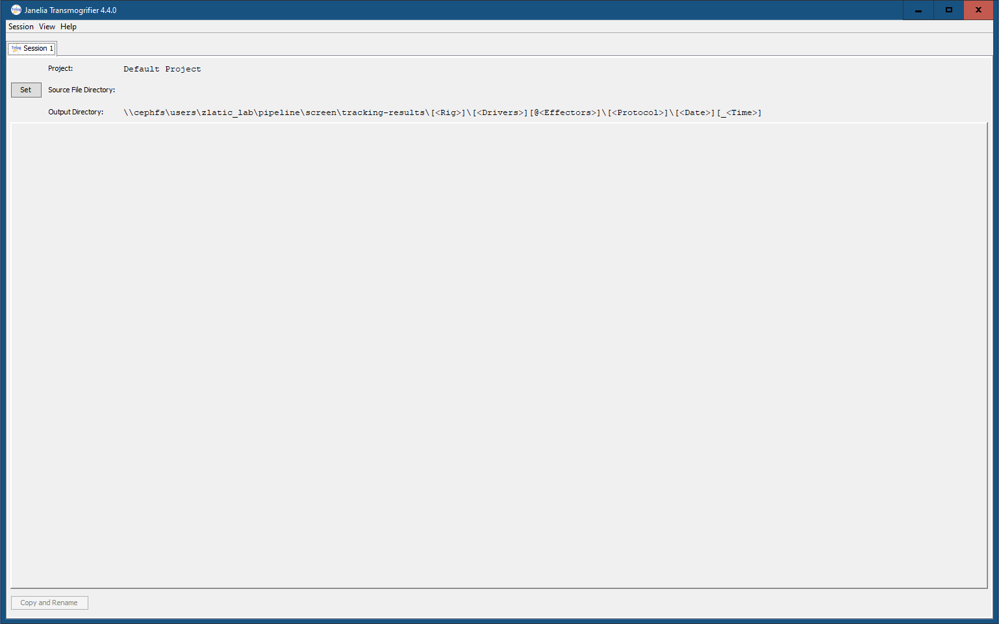

[](https://github.com/JaneliaSciComp/tmog/blob/master/LICENSE.md)

# Janelia Transmogrifier - tmog

The Janelia Transmogrifier - 'tmog' - is a Java Swing application that supports the collection and 
validation of meta data associated with files.  You can find [build instructions here](docs/BUILD.md). 

## Key Features

* Simple user interface for entering meta data information.
  * Drop-down selection lists for enumerated values.
  * Allows values entered for one file to be copied the next file with a single click.
  * Supports mouse and keyboard navigation.
  
* Configurable data field, syntax validation, and naming rules.

* Validated file transfer from source to destination file systems 
  (e.g. from local scope file system to a network mounted file system).
  * Digests (default is md5) of file contents are calculated before and after transfer to ensure integrity.

* Supports addition of external system plug-in components for validation and/or process integration.

## Usage

On Windows, the easiest way to launch tmog is to use the launcher (in `build/bin/tmog.exe`). You can also create a shortcut to the launcher, or pin it to the Start menu or the taskbar.
Alternatively, you can launch tmog from the command prompt via
```bash
java.exe -jar build\libs\tmog-<version>.jar [config.xml]
```

On Unix, you can launch tmog from a terminal via
```bash
java -jar build/libs/tmog-<version>.jar [config.xml]
```

After launching tmog, if you used the launcher (Windows-only) or if you didn't provide a path to a configuration file when launching through the jar, you'll be asked to select a configuration file.
Once the configuration is loaded, a new window should appear, like the one in the left image below:

 

Check that the path next to "Output Directory:" is correct before proceeding. Then, click on the "Set" button, which should be to the left of "Source File Directory:", to select the directory containing the files which will be transferred through tmog. After selecting a directory, its contents will be parsed and used to populate the table in the middle of the window (see right image above). Inspect all rows and columns to make sure all cells in the table look correct and there aren't any empty cells. But don't worry, if you try to proceed with the transfer, and any of the cells have invalid values or are empty, you'll be notified and not allowed to proceed. To start the transfer, click on the "Copy and Rename" button on the bottom left of the window. Once the transfer is complete, a new window will open with a summary of the transfer.

## Configuration

The application can be configured to support multiple projects with different requirements. 
This is designed to be a "self-serve" feature that allows researchers to make changes themselves as their 
environment changes.

## Task Models

For each file it processes, the tool can be configured to either:
* collect meta data and pass that meta data to any plug-ins for processing or
* collect meta data, rename and move the file based upon that meta data, 
  and then pass the meta data to any plug-ins for processing.

## Data Fields

The specific data fields collected for each file and their validation constraints are configurable. 
The following data field elements can be used to collect and validate values entered by the user:

```xml
<text displayName="Promoter" pattern="[0-9A-Za-z\\-]++"/> 
```
> Inserts a user provided text value and validates against a configured Java regular expression pattern.

```xml
<number displayName="Plate" minimumValue="1" maximumValue="999"/>
```
> Inserts a user provided integer value and validates against configured minimum and maximum values.

```xml
<decimal displayName="Interval" minimumValue="0.1" maximumValue="9.9"/>
```
> Inserts a user provided decimal (floating point) value and validates against configured minimum and maximum values.

```xml
<validValueList displayName="Gender">
    <validValue displayName="m: Male" value="m" />
    <validValue displayName="f: Female" value="f" />
    <validValue displayName="x: Not Defined" value="x" />
</validValueList>
```
> Inserts a user selected value from a configured list of acceptable values.

```xml
<well displayName="Well" formFactor="96"/>
```
> Inserts a user provided well identifier and validates against a configured form factor.

The following data field elements can be used to insert derived or configured values not provided 
directly by the user:

```xml
<separator value="GMR-" />
```
> Inserts a static configured text value.

```xml
<fileModificationTime datePattern="'-C'yyMMdd'-'" />
```
> Inserts the file modification time using a configured format pattern.

```xml
<runTime datePattern="yyyyMMddHHmmssSSS" />
```
> Inserts the rename process run time using a configured format pattern.

```xml
<pluginData displayName="imageLocationRank" format="%02d"/>
```
> Inserts formatted text data retrieved through a configured plug-in component.

## Plug-in Components

Plug-in component classes can be mapped to events in the collection process (e.g. validation, task initiation, and task completion). The components listed below have been developed to address specific lab needs. New plug-in components can be developed as new needs arise.

* Session Summary File Writer
  * Writes the summary message from each completed session into a file so that the information can be referenced later (e.g. for pasting into lab notebooks).

* REST Data Plug-in
  * Converts collected meta data into HTTP POST requests for a Representational State Transfer data server.

## Rename Output Directory

The destination for renamed files can be explicitly configured or you can let the user manually select a destination for each session.


## File List Sorting

The order in which files are sorted for each session can be configured.

## Renaming the Renamer

This tool was formerly called the 'Image Renamer' because its original use was to rename microscope image files, 
embedding collected meta data into the new file names. As the tool's feature set expanded beyond just renaming, 
we decided to rename the tool itself to something less restrictive. 

Don Olbris, our resident naming expert, came up with the name 'Transmogrifier' which was likely inspired 
by this [Calvin and Hobbes cartoon sketch](http://www.lovine.com/hobbes/comics/transmogrifier.html).

Over the years, 'Transmogrifier' got shortened to simply 'tmog' and that name has stuck.